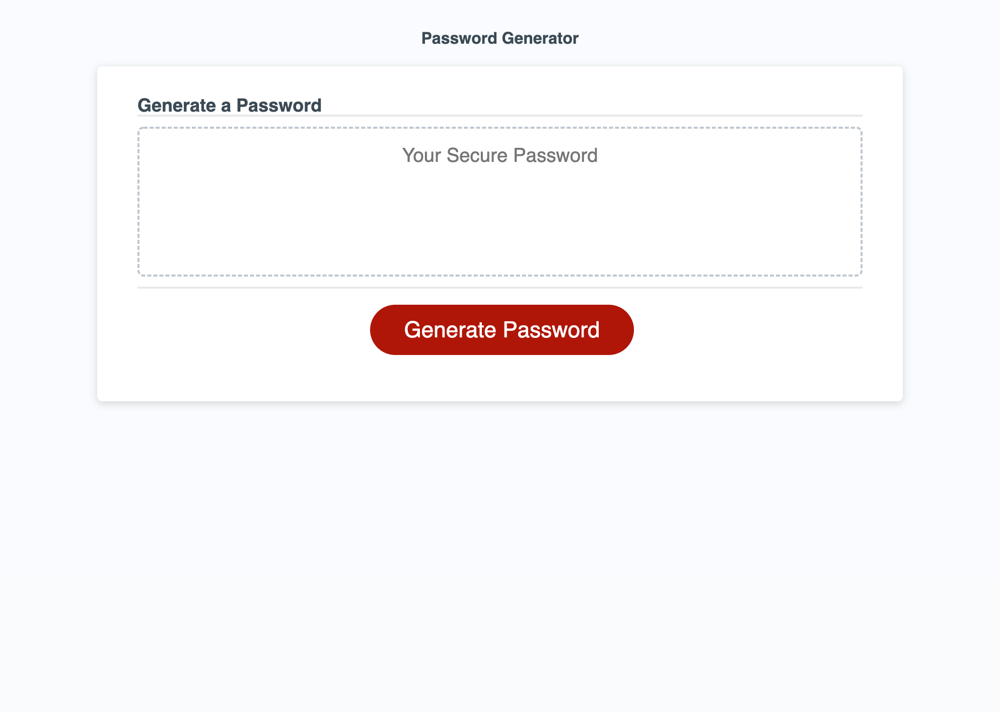

# random-password-generator

## Description

My goal for this project was to create a random password generator. This application gives the user the ability to create an 8-128 character password made of a random combination of their choice of lower case, upper case, numerical and special characters. This is important for creating strong passwords and increasing internet security.

To achieve this, I used Javascript.

During this project, I consolidated my understanding of Javascript. In particular, I re-inforced what I have learnt about:
- Variables
- Arrays
- Operators
- Conditional statements
- And, for loops.

In the future, I would like to re-visit this project and explore how I could use CSS to improve the user experience. In particular, I would like the user to select their password preferences directly on the screen instead of via prompts.

## Access

To access the live application via Github Pages, click [here](https://hayleyarodgers.github.io/random-password-generator/). 

To access the repository where the code I refactored is saved, click [here](https://github.com/hayleyarodgers/random-password-generator).

## Credits

This is the [starter code](https://github.com/coding-boot-camp/friendly-parakeet) that I refactored from [Xandromus](https://github.com/Xandromus/Xandromus).